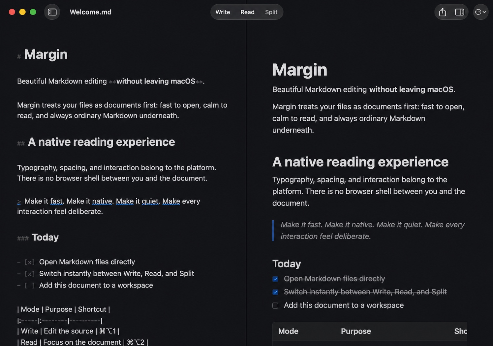
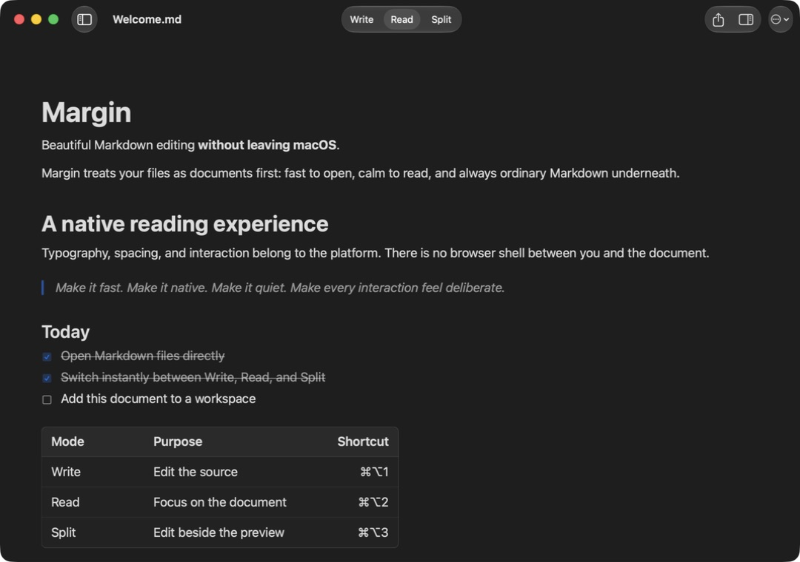
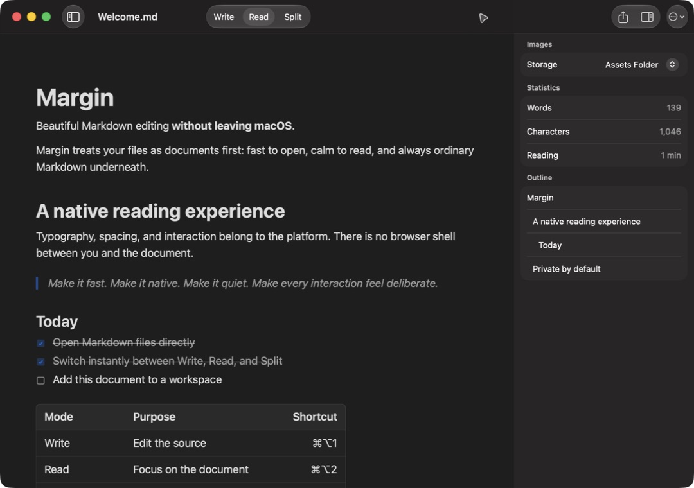

# Margin

Margin is a native Markdown editor and reader for macOS. It keeps documents as ordinary Markdown files and gives the same source three useful presentations: Write, Read, and Split.



There is no document library to migrate into and no account to create. Open a file, work in the view that fits the moment, and keep the result portable.

## Write, read, or use both

- **Write** is a TextKit 2 editor with list continuation, native find, spelling, formatting commands, and hybrid Markdown styling.
- **Read** turns the file into a native SwiftUI document with interactive task lists, tables, code blocks, links, and images.
- **Split** keeps the source and rendered document together while you edit.



## What Margin includes

- native open, save, autosave, undo, and window restoration
- outline navigation, document statistics, and backlinks
- folder workspaces with Quick Open, fuzzy matching, content search, and regular expressions
- drag-and-drop links and image assets with relative paths and collision-safe names
- external-file monitoring with safe reloads and explicit conflict resolution
- HTML, PDF, and rendered-HTML clipboard export
- Quick Look previews and Spotlight indexing for workspace documents
- a keyboard-driven command palette and native menu commands
- a bundled `margin` command for files, folders, stdin, Reader mode, and export



## Requirements

- macOS 15 or later
- Xcode 16 or later to build from source

## Build from source

Build a Release app into the repository's ignored `build` directory:

```sh
xcodebuild \
  -project Margin.xcodeproj \
  -scheme Margin \
  -configuration Release \
  -destination 'platform=macOS' \
  -derivedDataPath build \
  build

open build/Build/Products/Release/Margin.app
```

The local build is suitable for development and evaluation. Maintainers who want to distribute a
signed binary can use [`scripts/release.sh`](scripts/release.sh), which verifies Developer ID
signatures, submits with `notarytool`, staples the ticket, and checks Gatekeeper acceptance.

## Command-line tool

Choose **Margin → Install Command Line Tool…** to copy `margin` to a directory on your `PATH`. You can also run the copy embedded in a source build:

```sh
build/Build/Products/Release/Margin.app/Contents/SharedSupport/bin/margin --help
```

Common uses:

```sh
margin README.md
margin .
margin --read README.md
cat README.md | margin

margin export README.md --html
margin export README.md --pdf --output README.pdf
```

## Test

```sh
xcodebuild \
  -project Margin.xcodeproj \
  -scheme Margin \
  -destination 'platform=macOS' \
  -derivedDataPath build/tests \
  test
```

The target layout and security boundaries are documented in
[`docs/architecture.md`](docs/architecture.md).

## Privacy

Margin works locally. It has no account system, analytics, tracking SDK, or cloud service. Workspace
and supporting-file access use macOS security-scoped bookmarks, and documents stay where you put
them. Web links remain clickable, but remote images are not loaded; local images are embedded into
HTML and PDF exports.

## Project status

Margin is currently at `0.1.0`. The source repository includes the editor, reader, workspace,
export, Quick Look, Spotlight, and command-line targets.

## License

Margin is available under the [MIT License](LICENSE).
